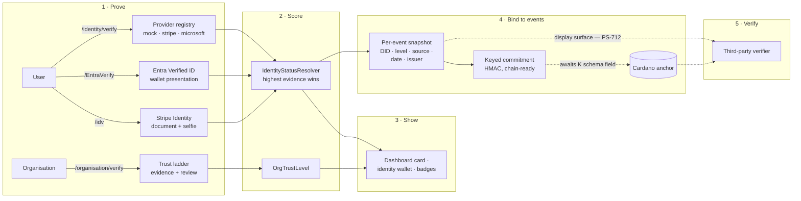

# Secuura Identity Layer

**Secuura Platform-S · ID Integration project · 29 Aug 2026**

How organisations and users prove who they are to the platform, how that proof is scored,
retained, bound to every document event, and prepared for the chain — verified statement by
statement against the shipped code.

---

## The five statements, checked against the code

| Statement | Status | What the code says |
| -- | -- | -- |
| **1 · Organisations and users confirm who they are through third parties** (Entra ID, Stripe ID) | ✅ **In place** | Three person-side entry points, one org-side ladder — all live routes, open to every signed-in tier. Entra end-to-end awaits tenant configuration only (PS-684). |
| **2 · Secuura can add further identification providers** | ✅ **In place** | A provider registry with two person-side contracts and one org-side contract. A new provider is an interface implementation plus a DI registration — no flow changes. |
| **3 · The platform maintains a level of identification and shows it** | ✅ **In place** | One resolver reconciles all evidence into an assurance level per person and a trust level per organisation. Shown on the dashboard, the identity wallet, and both verify pages. (One polish item: the dashboard card still reads the legacy Entra column rather than the resolver — PS-715.) |
| **4 · Retained and applied to the chain with document events** | 🟡 **S-side done** | Every document event carries an immutable five-field identity snapshot plus a chain-ready keyed commitment. The commitment awaits one field in platform-k's anchor schema before it rides the anchor. |
| **5 · A third-party verifier sees the ID information** | ⚪ **Data ready** | Filed as **PS-712**. The verify result page renders certificate, anchor and integrity today — no identity yet. Everything it needs to say *"signed by an identity confirmed by Stripe on 12 March 2026, vouched for by Contoso Ltd"* is now recorded per event. |

"In place" = merged to `develop` and covered by the 2,330-test suite. Feature master switch:
`Identity:Enabled` (default off; deployments opt in).

## How it works, end to end

Solid arrows are shipped and tested. Dotted arrows are the two remaining hops: the anchor field
on platform-k (KS-721), and the verifier-facing display (PS-712).

## 1 · Proving identity

### Users — three routes, one rule

Every signed-in tier can verify *itself* (the same tier rule as editing your own details —
PS-456 aligned all three entry points):

- **`/identity/verify`** — Secuura's native flow through the provider registry, linked from the
  sidebar's **ID** section.
- **`/EntraVerify`** — present a Verified Employee credential from a Microsoft Entra wallet; the
  platform checks the credential identifies *you* (email claim match, fail-closed) and records
  who issued it.
- **`/idv`** — Stripe Identity document-and-selfie checks.

Sources: `KycVerificationController` · `EntraVerify.cs` · `IdvController.cs`

### Organisations — a trust ladder

**`/organisation/verify`** lets an account admin raise the organisation above *DomainVerified*
by submitting evidence — registry documents, beneficial ownership, government-issued proof —
reviewed on an admin surface. SSO onboarding already establishes the tenant-verified baseline.

Levels: Unverified → DomainVerified → DocumentVerified → KycVerified → GovernmentVerified.

Sources: `OrganisationVerificationService` · `OrgVerificationProviders`

## 2 · Adding providers

Identification providers are plug-ins behind three small contracts:

| Contract | Shape | Today |
| -- | -- | -- |
| `IKycAssessor` | Platform holds the evidence, provider adjudicates it | mock (dev/test) |
| `IKycSessionProvider` | Provider hosts the whole session, returns a verdict by callback | Stripe Identity · Entra Verified ID |
| `IOrgVerificationProvider` | Organisation-side evidence review | manual-review · admin-override |

Selection is configuration, not code: `Identity:DefaultProvider` picks the default, and regional
policy (`AllowedKycProviders`) can restrict which providers serve which jurisdictions. A new
integration — another IdP, a national eID scheme — implements one interface and registers in DI;
every flow, gate and display picks it up unchanged.

## 3 · One level, everywhere

`IdentityStatusResolver` is the single source of truth. It reads all three evidence stores — the
native platform profile, Stripe IDV results, Entra verification — and answers with the **highest
level any source supports**: *None → Standard → Enhanced → High → Government*. Evidence is
additive; no source can downgrade a subject.

- **Dashboard** — a verified-status card, personal for users, organisational for issuers.
- **Your details** (`/useredit`) — the identity wallet: your DID, assurance level, and held
  verifiable credentials.
- **Verify pages** — current level, verification history, and the org's current trust tier.

The same level also *gates* actions where configured — a minimum assurance to share
(`MinShareAssuranceLevel`) and per-action gates — so the score is load-bearing, not decorative.

## 4 · Bound to every document event

When a document is signed, declared, or has rights assigned, the event row is stamped — at that
moment, from the resolver — with a point-in-time snapshot that is **additive, immutable, and
deliberately survives erasure** of the person's mutable records:

1. **Who acted** — the actor's DID and assurance level *(PS-364)*
2. **Which system established it and when** — evidence source and the verification's own date,
   not the event's *(PS-709)*
3. **Who vouched** — the issuing authority's DID for credential-based evidence: "employment
   confirmed by Contoso Ltd", not "verified via Microsoft" *(PS-710)*
4. **A chain-ready keyed commitment** over all of the above plus the event id *(PS-711)*

### Why a commitment and not the data

Raw identity on an immutable public chain would make the right to erasure impossible, and a bare
hash of an identity is guessable — the search space of "name × provider × date" is small enough
to enumerate. The commitment is an HMAC under a dedicated rotating key: **opaque to the world,
verifiable by the platform, referring to nothing once the off-chain evidence is gone**. It is
also the only shape platform-k's own anchoring rule permits — "only opaque tokens/hashes go
on-chain".

The one open hop: platform-k's anchor schema must gain the `identityCommitment` field (it
currently strips unknown keys) — **KS-721**. K deploys first, then one field on the S request.
Nothing is lost while waiting — snapshots are immutable, so every event recorded since PS-709
can anchor its commitment whenever its anchor carries it.

## 5 · What the verifier will see

The verify surface today proves the *document*: certificate, chain anchor, integrity. The
identity layer's remaining step (**PS-712**) is to put the actor beside it — for each event in
the lineage:

> "Signed by a holder whose identity was confirmed by **Stripe Identity** on **12 March 2026**
> at assurance level **High** — employment vouched for by **Contoso Ltd** — and this claim is
> anchored, tamper-evident, on chain."

Every noun in that sentence is now recorded per event. The display work is rendering, not
archaeology — which is exactly the position the ID Integration project set out to reach:
**capture what cannot be backfilled, before building what can be built any time.**

## Remaining work and its impact

| Item | Status | Impact on the statements |
| -- | -- | -- |
| **PS-684** — Entra tenant setup (app registration, Verified Employee credential, seven secrets, redeploy) | 🟡 In progress | Gates a real Entra end-to-end run on dev-ps. Configuration, not code — statement 1's Entra path is built. |
| **PS-708** — dev-ps Entra tenant's own subscription and authority | ⚪ Backlog | Infrastructure hygiene; no functional impact on the statements. |
| **KS-721** — anchor schema accepts and anchors the opaque `identityCommitment` field (platform-k) | ⚪ Filed | Completes statement 4's final hop: commitment rides the anchor onto the chain. K deploys first, then one field on the S request. |
| **PS-712** — verifier display surface: identity beside certificate/anchor on the verify result | ⚪ Filed · High | Delivers statement 5. All data exists; rendering only. |
| **PS-714** — /EntraVerify records a ConsentRecord like every other verification flow | ⚪ Filed | Compliance hardening of statement 1; flow already works. |
| **PS-713** — multi-credential matcher refinement | ⚪ Filed | Edge case, unreachable today; fails closed. |
| **PS-715** — dashboard verified card reads the legacy Entra column, not the identity resolver | ⚪ Filed | Statement 3 polish: a Stripe- or platform-verified user should read as verified on their own dashboard, as they already do everywhere else. |

---

Verified against `develop` (post PR #671, 2,330 tests passing) and the Linear ID Integration
project, 29 Aug 2026. Follow-ups PS-712–PS-715 and KS-721 filed and cross-linked the same day.

Key sources: `IdentityStatusResolver` · `DocumentIdentityService` · `IdentityEvidenceCommitment`
· `EntraVerifiedIdService` · `KycService` · `OrganisationVerificationService` · platform-k
`anchorSchema.ts`.
